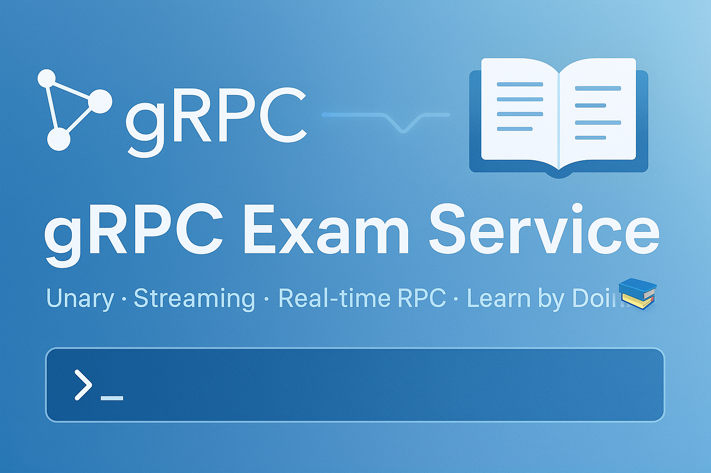

# gRPC Exam Service 📚



A fun, modular gRPC service for fetching exam results using different gRPC communication types:
- Unary RPC
- Server Streaming
- Client Streaming
- Bidirectional Streaming

Cleanly structured for scalability and learning.

---

## 🌐 Project Structure

```bash
.
├── client/
│   ├── clients/
│   │   ├── unary.go
│   │   ├── server_stream.go
│   │   ├── client_stream.go
│   │   ├── bi_stream.go
│   └── main.go
├── proto/
│   ├── exam.proto
│   └── generated/exampb/
│       ├── exam.pb.go
│       └── exam_grpc.pb.go
├── server/
│   ├── main.go
│   └── servers/
│       ├── unary.go
│       ├── server_stream.go
│       ├── client_stream.go
│       ├── bi_stream.go
│       └── exam_service_server.go
├── unit_test/
│   └── server/
│       ├── unary_test.go
│       ├── server_stream_test.go
│       ├── client_stream_test.go
│       └── bi_stream_test.go
├── utils/
│   └── logger.go
├── go.mod
├── go.sum
└── Makefile

---

## 📚 Features

| Type               | File                                  | Description                                |
|--------------------|---------------------------------------|--------------------------------------------|
| Unary              | `unary.go`                            | Fetch a single exam result                 |
| Server Streaming   | `server_stream.go`                    | Fetch multiple results for a student       |
| Client Streaming   | `client_stream.go`                    | Send multiple requests, get summary        |
| Bidirectional      | `bi_stream.go`                        | Live querying of student exam results      |

---

## ⚙️ Usage

### 1. Generate gRPC code
```bash
make proto -B
```

### 2. Run the server
```bash
go run server/main.go
```

### 3. Run the client
```bash
# Unary RPC
go run client/main.go unary

# Server Streaming
go run client/main.go server

# Client Streaming
go run client/main.go client

# Bidirectional Streaming
go run client/main.go bi
```

---
## 🧪 Testing

This project includes comprehensive tests covering all RPC types (Unary, Server Streaming, Client Streaming, and Bidirectional Streaming) using:

- **Testify** for assertions  
- **GoMock** for mocking interfaces  

To run the tests, use:

```bash
go test ./unit_test/server -v
```

---
## 🔧 Tools Used
- **gRPC & Protocol Buffers** – for defining and implementing the 4 types of RPCs
- **Go Modules** – for dependency management
- **slog** – structured logging for better debugging and traceability
- **Go Test** – for unit testing server-side logic
- **Makefile** – to simplify running proto generation, server, and client commands

---

## 🚀 Quick Example (Bi-Directional)
```bash
Enter student_id and exam_id (or 'exit'): 123 math101
🎓 John Doe | Math 101: 95/100 (A+)

Enter student_id and exam_id (or 'exit'): exit
👋 Session ended.
```

---

## ✨ Have fun learning gRPC with this mini project!

